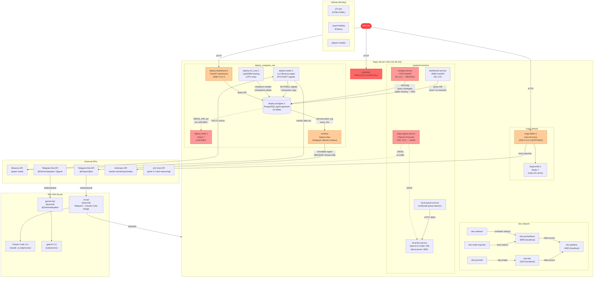

# System Dependency Map — 2026-03-21

> RESEARCH ONLY. Maps all data flows, service dependencies, and credential paths.
> Nodes = services/repos. Edges = data flow direction.

---

## I. Mermaid Architecture Diagram



---

## II. Data Flow Inventory

### Primary Signal Path (zangetsu)

```
Binance API
  → trader (ccxt, paper mode)
  → PostgreSQL execution_log (INSERT)
  → echelon (SELECT WHERE id > last_seen, every 15s)
  → Telegram Bot API (sendMessage)  ← BROKEN: thread 400
```

### Model Training Path

```
PostgreSQL (ohlcv_1m — EMPTY, regime_vectors, champions)
  → ml_core (LightGBM training, CPU-only)
  → PostgreSQL (champions table, UPDATE)
  → trader (reads champion model for signals)
```

**Note**: ohlcv_1m is empty. ml_core is running but has no market data to train on. Source of training data is unknown without inspecting container source.

### LLM Routing Path (magi)

```
Client request
  → LiteLLM proxy :4000 (internet-exposed, master_key: sk-alaya-litellm-2026)
  → Anthropic API (claude-sonnet-4-6 / claude-opus-4-6 / claude-haiku-4-5)
  → Redis cache (magi-redis-1)
```

### Local AI Path (alaya)

```
File drop to ~/.claude/scratch/queue/qwen/
  → local-queue.service (inotifywait)
  → llama-server :8001 (Qwen2.5-Coder-14B, 10.3GB VRAM)
  → response file
```

### Observability Path

```
Docker containers + host OS
  → cadvisor (container metrics) + node-exporter (host metrics)
  → Prometheus :9090 (scrape, 15s interval)
  → Grafana :3000 (visualize)

Container logs
  → promtail (scrape Docker logs)
  → Loki :3100
  → Grafana (query via LogQL)
```

---

## III. Credential / Secret Map

| Secret | Where Stored | Who Uses It | Risk |
|--------|-------------|-------------|------|
| ALAYA_BOT_TOKEN | ~/j13-ops/infra/echelon/.env | echelon | medium (server-local) |
| ALAYA_BOT_TOKEN | alaya-agent systemd env | alaya-agent | medium |
| GROK_BOT_TOKEN | grok-bot systemd/env | grok-bot | medium |
| ANTHROPIC_API_KEY | magi-litellm .env | LiteLLM → Anthropic | high (billable) |
| XAI_API_KEY | grok-bot env | grok-bot | high (billable) |
| GROUP_CHAT_ID | multiple .env files | all bots | low |
| LiteLLM master_key | litellm_config.yaml | LiteLLM proxy | HIGH (internet-exposed) |
| github_pat_* | ~/.config/gh/ on alaya | gh CLI | medium (read-only PAT) |
| POOL_DATABASE_URL | zangetsu deploy .env | all zangetsu containers | high (contains password) |
| ZANGETSU_DB_URL | miniapp env | miniapp (Railway URL) | medium (broken anyway) |
| SSH private key | ~/.ssh/ on Mac | Tailscale SSH to alaya | high |

---

## IV. Docker Network Topology

```
deploy_zangetsu_net (bridge):
  postgres:5432  ← trader, ml_core, dashboard, echelon
  redis:6379     ← trader (UNUSED)
  zangetsu containers communicate by service name

magi_default (bridge):
  litellm:4000   ← internal routing
  redis:6379     ← litellm cache

obs (bridge):
  prometheus:9090
  loki:3100
  grafana:3000
  promtail, cadvisor, node-exporter

All three networks are ISOLATED from each other.
No cross-network traffic observed.
```

---

## V. Orphaned / Dead Paths

| Path | Description | Status |
|------|-------------|--------|
| amadeus → Telegram | amadeus.service unit exists, no source | ORPHAN |
| king-crimson → ? | king-crimson.service unit exists, no source | ORPHAN |
| r-steiner → ? | r-steiner.service unit exists, no source | ORPHAN |
| dcbot → Discord | dcbot.service unit exists, no source | ORPHAN |
| alaya-agent → Telegram | 1057 LOC of Planner+Executor | DEAD (service down) |
| miniapp → Railway PostgreSQL | queries `strategies` table | BROKEN |
| trader → Redis | REDIS_URL set in env | UNUSED |
| ohlcv_1m → ml_core | market data source for training | EMPTY |

---

## VI. Inter-Service Dependencies (Startup Order)

Critical path for zangetsu stack:
1. `deploy-postgres-1` must be healthy before trader/ml_core/dashboard/echelon start
2. `deploy-trader-1` generates signals → `deploy-ml_core-1` uses same DB
3. `echelon` depends only on PostgreSQL (independent of trader uptime)
4. `deploy-dashboard-1` depends only on PostgreSQL

No hard dependency between zangetsu stack and magi stack.
Observability stack is fully independent (external network, read-only scraping).

---

*Collected: 2026-03-21 via SSH direct query.*
